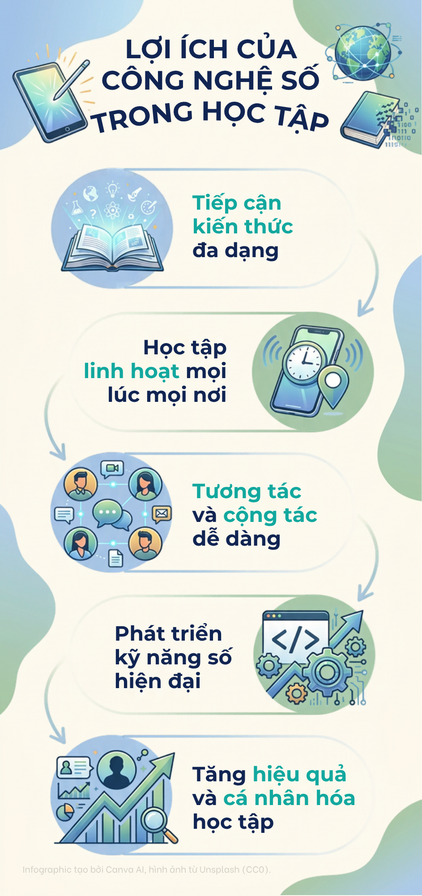

# CT005_B2604673_Lab05

Repository for Lab 05 of the CT005 course, developed by Le Ngoc Thien (CTU - B2604673).

## Overview

This project is intended as a structured learning repository for the CT005 course assignment. The purpose is to demonstrate proper project organization, version control practices, and documentation.

The repository includes the project documentation, licensing information, and source materials required for the lab assignment.

## Objectives

- Understand the requirements of the lab assignment.
- Set up a clean and maintainable repository structure.
- Apply Git and GitHub workflow principles.
- Produce professional project documentation.
- Ensure the project is easy to clone, run, and understand.

## Lab05_Ex2.2

https://www.youtube.com/embed/Lpy5nkSxcEs

## Lab05_Ex3.2

https://github.com/NerfKenzy3508/CT005_B2604673_Lab05.

## Infographic: Benefits of Digital Technology in Learning



The infographic **“Lợi ích của công nghệ số trong học tập”** (Benefits of Digital Technology in Learning) presents five ways that digital technology can support learners:

1. **Tiếp cận kiến thức đa dạng — Access to diverse knowledge**  
   Digital platforms provide access to electronic books, online courses, educational videos, simulations, and other learning resources. Learners can explore subjects beyond the limits of a single textbook or classroom.

2. **Học tập linh hoạt mọi lúc mọi nơi — Flexible learning anytime, anywhere**  
   Computers and mobile devices allow students to study at a suitable time and location. This flexibility supports self-paced learning and makes education more accessible.

3. **Tương tác và cộng tác dễ dàng — Easier interaction and collaboration**  
   Online classrooms, discussion forums, video meetings, and shared documents help students communicate, exchange ideas, and work together even when they are not in the same place.

4. **Phát triển kỹ năng số hiện đại — Development of modern digital skills**  
   Using digital learning tools helps learners practise information searching, online communication, collaboration, content creation, and responsible use of technology—skills that are valuable for further study and future careers.

5. **Tăng hiệu quả và cá nhân hóa học tập — Increased effectiveness and personalized learning**  
   Digital tools can provide immediate feedback, track progress, and offer learning materials suited to different abilities and needs. As a result, students can identify areas for improvement and learn more effectively.

### Message of the infographic

Technology is a tool that can enrich learning when it is used purposefully. To gain the greatest benefits, learners should evaluate the reliability of online information, protect their privacy, respect copyright, and maintain a healthy balance between screen time and other learning activities.

### Source and AI attribution

- **Infographic creation:** Canva AI, used to generate and arrange the visual design and illustrations.
- **Image resources:** Unsplash, indicated as CC0/public-domain resources in the infographic caption.
- **Text and documentation:** Written for this repository to describe the visual content and its educational benefits.

The infographic is included for educational and illustrative purposes. Where applicable, users should verify the original license and attribution requirements of each third-party visual asset before redistributing the image.

## Repository Structure

```text
CT005_B2604673_Lab05/
  ├── lab05/
  │   ├── README.md
  │   ├── Lab05_Ex2.1.png
  │   ├── Lab5_Ex3.1.html
  │   ├── Lab05_Ex1.1.pdf
  │   └── Lab05_Ex1.1.docx
  └── LICENSE
```
